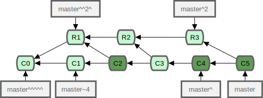

<!--
SPDX-FileCopyrightText: 2008 Geoffrey Grosenbach <boss@topfunky.com>
SPDX-FileCopyrightText: 2008 Scott Chacon <schacon@gmail.com>

SPDX-License-Identifier: CC-BY-SA-3.0
-->

## The Treeish

Besides branch heads,
there are a number of shorthand ways
to refer to particular objects in the Git data store.
These are often referred to as a *treeish*.
Any Git command that takes an object -
be it a commit,
tree or blob -
as an argument can take one of these shorthand versions as well.

I will list here the most common,
but please read the\
[rev-parse command](https://mirrors.edge.kernel.org/pub/software/scm/git/docs/git-rev-parse.html)\
for full descriptions of all the available syntaxes.

#### Full SHA-1

```
dae86e1950b1277e545cee180551750029cfe735
```

You can always list out the entire SHA-1 value of the object
to reference it.
This is sometimes easy if you're copying and pasting values
from a tree listing or some other command.

#### Partial SHA-1

```
dae86e
```

Just about anything you can reference with the full SHA-1
can be referenced fine with the first 6 or 7 characters.
Even though the SHA-1 is always 40 characters long,
it's very uncommon for more than the first few to actually be the same.
Git is smart enough to figure out a partial SHA-1 as long as it's unique.

#### Branch or Tag Name

```
master
```

Anything in *.git/refs/heads* or *.git/refs/tags*
can be used to refer to the commit it points to.

#### Date Spec

```
master@{yesterday}
master@{1 month ago}
```

This example would refer to the value of that branch yesterday.
Importantly,
this is the value of that branch *in your repository* yesterday.
This value is relative to your repo -
your 'master@{yesterday}' will likely be different than someone else's,
even on the same project,
whereas the SHA-1 values will *always* point to the same commit
in every copy of the repository.

#### Ordinal Spec

```
master@{5}
```

This indicates the 5th prior value of the master branch.
Like the *Date Spec*,
this depends on special files in the *.git/log* directory
that are written during commits,
and is specific to *your* repository.

#### Carrot Parent

```
e65s46^2
master^2
```

This refers to the Nth parent of that commit.
This is only really helpful for commits that merged two or more commits -
it is how you can refer to a commit other than the first parent.

#### Tilde Spec

```
e65s46~5
```

The tilde character,
followed by a number,
refers to the Nth generation grandparent of that commit.
To clarify from the carrot,
this is the equivalent commit in caret syntax:

```
e65s46^^^^^
```



#### Tree Pointer

```
e65s46^{tree}
```

This points to the tree of that commit.
Any time you add a `^{tree}` to any commit-ish,
it resolves to its tree.

#### Blob Spec

```
master:/path/to/file
```

This is very helpful for referring to a blob
under a particular commit or tree.
